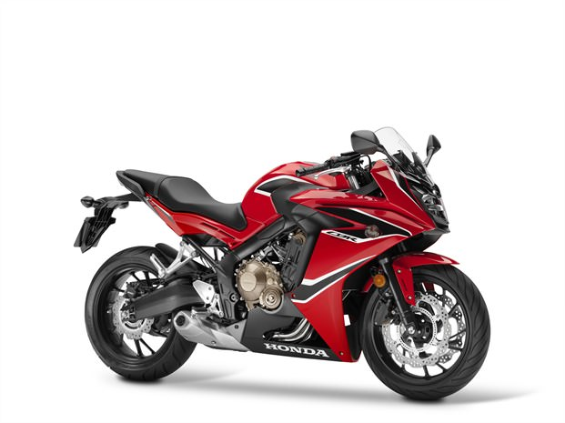
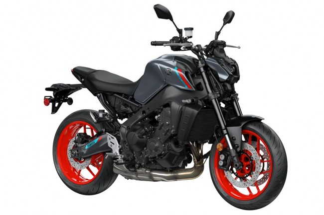
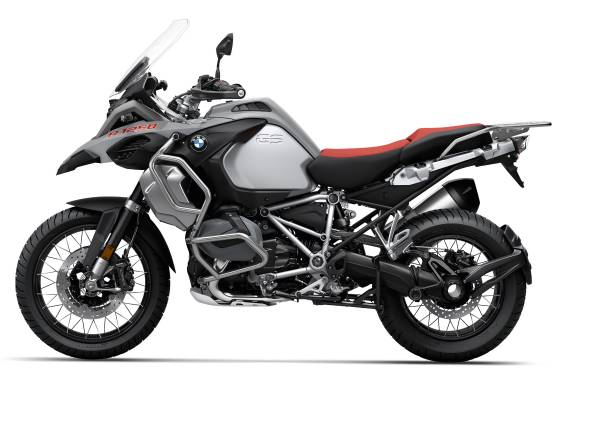
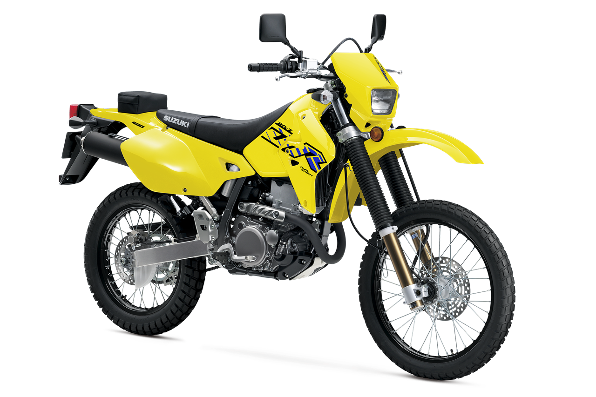
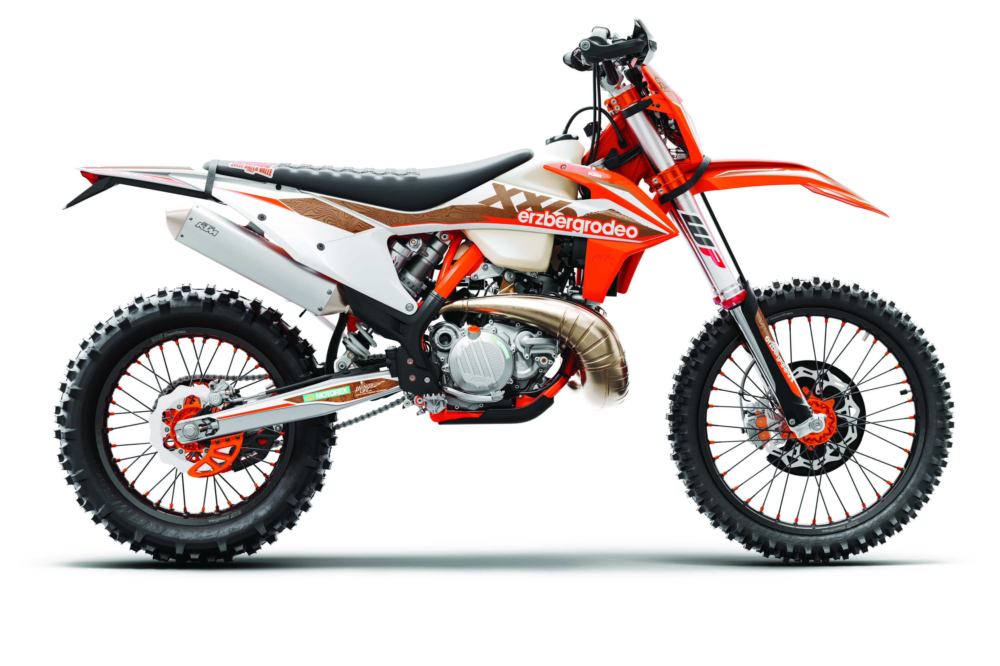
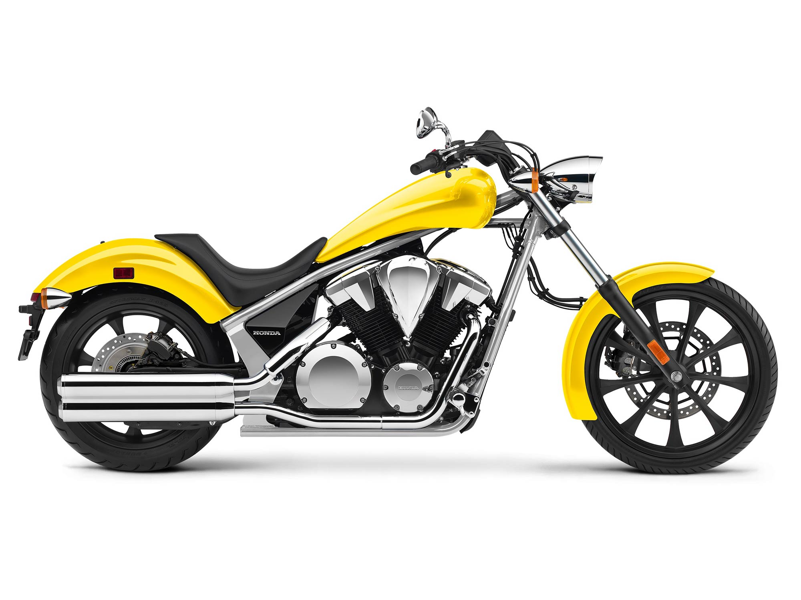
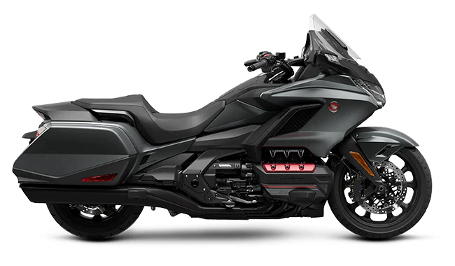
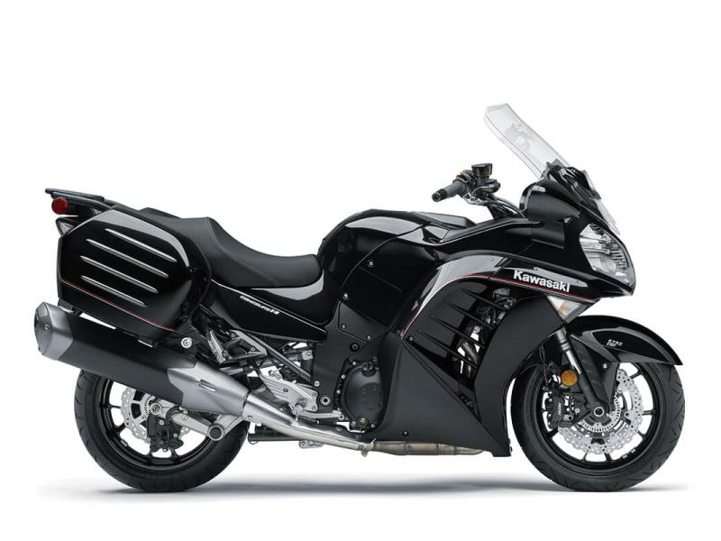
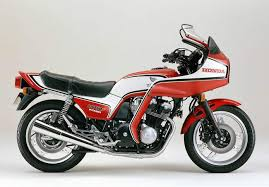
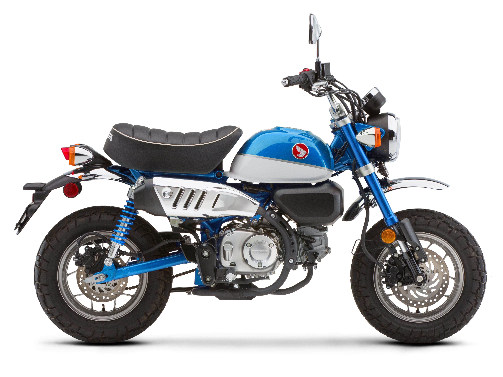

# Different Types of Motorcycles

While all motorcycles share some key similarities, each type has strengths, weaknesses, and unique features to fit just about every kind of rider out there (and for the rest, there are customs!). Check out the complete list of motorcycle types below: 

## Cruisers 

Pictured: Harley-Davidson 2020 Deluxe, MSRP $18,399 USD

One of the most popular motorcycle types in the world, and for good reason. Cruisers are known for being comfortable, varietal, and popular. Top cruiser brands include Harley-Davidson, Indian, and most metric manufacturers (like Honda, Suzuki, Yamaha, and Kawasaki). Typically cruisers are heavier bikes, with resulting lower power to weight ratios, and a focus on comfort and low-end torque. 

Pros: Comfort, ease, widely varietal models, community gatherings. 

Cons: Weight, power:weight ratio, costs (some models).

## Sportbikes

Pictured: Honda CBR650F, MSRP $8,749 USD

One of the most well-known and varietal categories of motorcycles, sportbikes can be cost-effective, reliable, powerful, and fast. These easily customizable bikes come in a variety of sizes, making them popular with riders of all types. Metric manufacturers dominate the market for sportbike production, while premium brands include BMW, Aprilia, and Ducati. Popular models worldwide include the Honda CBR, Kawasaki Ninja, and Yamaha YZF.

Pros: Varying sizes (125cc-1,000+), nimble, lightweight, cost-effective.

Cons: Comfort (aggressive body positioning), steep rake angle.

## Standard & Naked 

Pictured: Yamaha MT-09, MSRP $9,399

The “naked” bike is arguably one of the most versatile and simple types of motorcycles that a rider can buy. Also termed “standard” bikes or “streetfighters,” these motorcycles typically have no fairings, minimal to no windshields, and a more upright body positioning. Naked bikes tend to cross over into the “sportbike” column, with most bikes functioning on the track just as well as the street. 

Pros: Nimble, comfortable, versatile, lightweight, low seat height.

Cons: Lack of fairings, little to no windshield, minimal luggage options.

## Adventure (ADV) 

Pictured: BMW R 1250 GS Adventure, MSRP $20,345 USD

Adventure bikes were designed for exactly what their name suggests— adventures! These sturdy bikes are typically outfitted with a tall seat height, tall windshield, ample suspension travel, upright seating positioning, and plenty of luggage options. Most ADV bikes will also come equipped with on-road/off-road tires

Pros: Versatile, luggage capacity, comfort.

Cons: Possibly heavy, limited off-road capabilities. 

## Dual Sports & Enduros

Pictured: Suzuki DR-Z400S, MSRP $6,799 USD

Dual sports and enduros are about as close as you can get to a true dirtbike while still being street legal. These motorcycles are usually tall, narrow, lightweight, and feature upright seating and low to no windshields. Models can be ridden with street tires, dirt tires, or a mix of both depending on rider preference. 

Pros: Upright seating, off-road capabilities, lightweight, nimble.

Cons: Tall seat height, low/no windshield, possible small gas tank (dependent on model).  

## Dirtbikes

Pictured: 2021 KTM XC-W 300, MSRP $10,199 USD

True dirtbikes typically come in either 4-stroke, 2-stroke, or electric models. These motorcycles are designed solely for off-road riding, and lack the headlights, taillights, mirrors, and turn signals to make them street-legal.   

Pros: Lightweight, nimble, varietal model types and sizes.

Cons: Limited to offroad riding, tall seat heights (some models), kickstarts (some models), small gas tanks (some models). 

## Choppers

Pictured: 2020 Honda Fury, MSRP $10,599 USD

One of the most iconic looking motorcycles in the sport, choppers are a fan favorite due to their unique styling and classic place in riding culture. However, they’re often a difficult bike to ride. Some manufacturers produce chopper-style motorcycles straight off the factory floor, while many are made in custom motorcycle shops. Most will have limited rear suspension, and all will be challenging in corners due to the dramatic fork rake.  

Pros: Iconic styling, low set height. 

Cons: Fork rake, difficult handling, rear suspension limitations. 

## Touring

Pictured: Honda Goldwing, MSRP $23,000+ USD

The sportier cousin to Cruisers, Touring motorcycles were designed to go the extra mile. A more upright body positioning, luggage compartments, smooth handling, and motorcycle features like heated grips, seats, cruise control (and even cup holders!) take comfort to the extreme in these models.  

Pros: Smooth, stable, comfortable, spacious.

Cons: Weight, bulk, possibly overwhelming for new riders, cost (some models).

## Sport Touring

Pictured: Kawasaki Concourse14 ABS, MSRP $15,799 USD

Sport Touring bikes are one step even further in the “sportiness” direction. These bikes will typically have a slightly more aggressive body positioning, higher power outputs, and taller seat heights. 

Pros: Agile, powerful, spacious, versatile.

Cons: Taller seat height, weight, bulk, more aggressive body positioning.

## Vintage & Customs

Pictured: 1982 Honda CB 750F, $7,000 USD

Both vintage and custom motorcycles will come with their own unique challenges and strengths. For example, most vintage bikes will be carbureted, potentially making them easier to work on for riders who are mechanically inclined. However any major motorcycle customization can compromise the safety or change the handling of a bike, so savvy buyers should be wary of in-depth custom work when purchasing a vintage motorcycle. 

Pros: Cost-effective, simple, plentiful, varietal, heavily customizable. 

Cons: May need repairs/updates, customization could cause safety and handling concerns. 

## Modern Classics

Pictured: Bonneville T100, MSRP $10,450

Lately, there’s been a boost in the popularity of modern motorcycles that look vintage, but have all new components. Major manufacturers have noticed, and a complete line of “new-old” models have been released. These bikes are typically fuel injected (though some feature fake carburetors!), have low seat heights, modern components, and a more upright seating position. 

Pros: Low seat, moderate pricing, modern components (brakes, fuel injection, wiring, etc).

Cons: Low power, limited suspension (some models), limited power (some models).

## Commuters & Minis

Pictured: 2019 Honda Monkey, MSPR $3,999 USD

Covering a broad category, commuters and/or “mini” bikes are usually low-cc smaller motorcycles capable of nimbly navigating traffic and saving on both costs and fuel consumption. Many of these bikes have 125-250cc’s, making them perfect for new and city riders. 

Pros: Small, nimble, lightweight, low seats, cost-effective. 

Cons: Limited power, possible low visibility (due to motorcycle size). 

#### Sources:
[RideVision](https://ride.vision/blog/13-motorcycle-types-and-how-to-choose-one/)