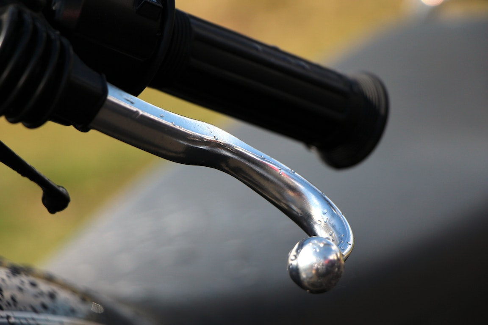

# Buying a Used Motorcycle

Buying a used motorcycle can be risky, but the savings can often be worth it.  Follow these tips to help lower the risk of a bad purchase.  Also, take a look at our [Popular Bikes](/popular) to find some good, reliable older bikes that you may be able to find used.

## 1. Check the VIN

This is the starting point. The rest of this guide is useless if you're looking over a stolen bike. Physically check the numbers and make sure numbers are not re-stamped. If you’re looking at bikes that have a high theft rate, like Harley-Davidsons, you might even want to bring pictures of factory-stamped numbers along for comparison if you don’t know what “knocked-over” numbers look like. Once you’ve eyeballed that, check that the title numbers match the headstock. If you can navigate the local motor vehicles bureaucracy, you can make some money on titling errors, but for most people who ain’t in the flippin’ game, title inconsistencies are a headache. Run.

## 2. Examine the bike cold

Especially on an older bike, tell the seller to leave the bike cold before you get there. It’s unbelievably easy to hide starting and running problems on a hot bike. Feel those jugs and the pipes to make sure that bike is ice cold! If the seller can’t get the bike started, or it sounds like a blender full of rocks for the first minute of run time, you might have some problems on your hands.

## 3. Examine the bar ends, levers, and footpegs

Their age should be commensurate with the bike. If they are damaged, the bike has been down. Look for rash, obviously, but levers can give away a few clues. Levers often “curl” when they hit the pavement. They might not be broken, and the seller might have buffed out the rash, but a curved appearance usually indicates damage. The same usually goes for “shorty” levers that a seller has cut and re-shaped. Most people don’t do this unless they need to replace a banged-up lever. Aftermarket lever and pegs are also a bit of a tip-off that a crash has occurred. If the seller cops to it, he may be an honest fellow who had a tipover and did his best to fix the bike. If it goes unmentioned, though, it could mean the seller is dishonest, or perhaps the bike suffered at the hands of a previous owner.

## 4. Assess the bike’s general condition

The odometer only tells one part of the bike’s story. If an owner hands you a file of receipts, that is a Very Good Thing. If the bike is generally well cared for — it has matching tires, shiny, waxed paint, and the owner has obviously replaced wear items like grips and seat covers — that’s a good indicator of what kind of bike you’re looking at. People are rarely fastidious with one part of their bike and lax with another. Usually they either love the bike or neglect it. If you see evidence of something that’s been unrepaired for a long time, it might be indicative of a bike that has other defects lurking. Similarly, a pristine owner’s manual, all the factory keys, and paperwork from aftermarket equipment with a box of OEM takeoff pieces usually point to a bike that received lavish attention.

The flip side of this is "disrepair through disuse." Check the oil level, and the color and level of the brake fluid. (It should be pale yellow, not dark brown or black.) Check for dry cables, pitted fork tubes, leaky fork seals, and rusty chains. Leaks of all forms are usually not good. Electrical items that are inoperable, spongy brakes, and rusty fuel tanks (yep, look in there with a flashlight) will let you know you either have some work ahead of you, or need to keep looking for a better bike.

## 5. Go for a test ride after a safety check

This is a two-pronged recommendation. First, there really is no reason why a test ride cannot happen. If you’re willing to put the full amount of the bike in cash in the seller’s hand, he has nothing to lose but a sale. The second piece of advice here is to safety-check the bike, especially if it has gone unridden for a bit. It sucks to be at the top of third gear when you find out the brakes need to be bled.

## 6. Make sure the paperwork is in order
If you’re buying a used motorcycle, you’ll need to do a little extra due diligence on your paperwork, particularly if you’re buying a bike directly from its owner. Take the time to ensure that all of the bike’s essential paperwork is squared away, including: 

1. Make sure the seller can present you with a title and that the Vehicle Identification Number (VIN) on the bike matches the VIN on the title. 
2. Write up a bill of sale and make sure that you and the seller both sign and date it. (You can find easy-to-use motorcycle bill of sale templates online.) 
3. Check with your state DMV to ensure that the motorcycle is legally registered to the seller. Be wary of anyone selling a bike that isn’t registered in their name, as the bike might be stolen. 
4. Use your state DMV’s website or another VIN search engine to ensure that the motorcycle has no liens against it from creditors and that its title is not a salvage title. 

If a private seller seems evasive about the bike’s history and records, stay on the safe side and move on. You don’t want the hassle and risk of buying a bike that may get you tied up in legal troubles when you try to register it, or one that’s been previously wrecked and is no longer safe to ride. 

## 7. Tune up
Once you’ve made your purchase, it’s always a good idea to invest in a tune-up for your new bike. You’ll want to develop a relationship with a trusted motorcycle mechanic, so now is the perfect time to find a shop you like. Ask your rider friends to recommend mechanics they trust or look up reviews online to find a great mechanic. 

A good motorcycle tune-up should include an oil change, plus a check of other fluid levels and brake pads. It’s also a good time to ask the mechanic any lingering questions you have about the bike mechanically—although hopefully, you’ve gotten clarification on any major points before making the final purchase. 

#### Sources
[CardoSystems](https://www.cardosystems.com/blog/motorbike-milestones-9-tips-for-buying-your-first-motorcycle/)
[Revzilla](https://www.revzilla.com/common-tread/dont-get-burned-used-bike-buying-tips)